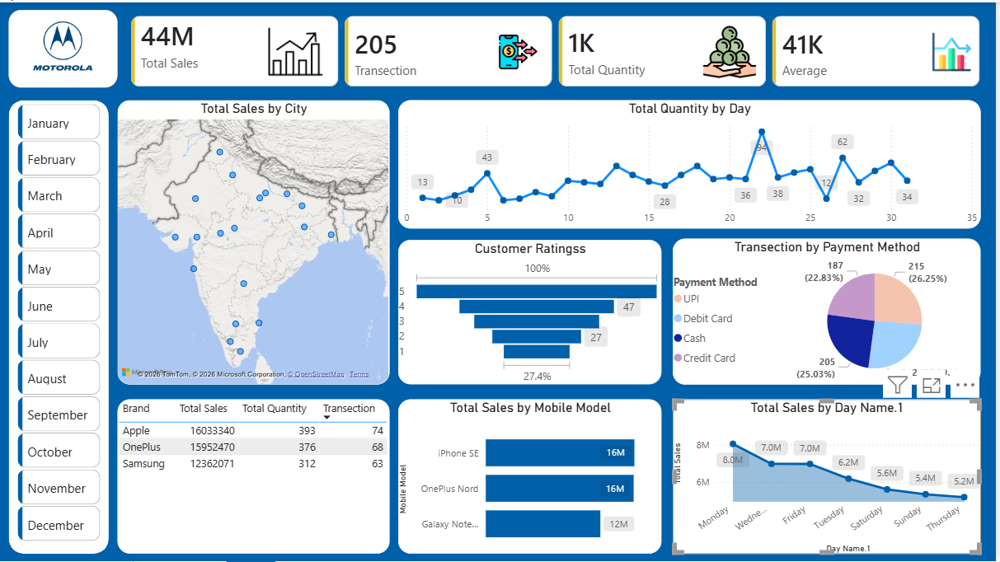

# Mobile-Sales-Dashboard-PowerBI
"Interactive Mobile Sales Dashboard in Power BI with KPIs, city-wise sales map, payment trends, and customer rating insights."
# 📱 Mobile Sales Dashboard - Power BI

## 📌 Project Overview
This project is an interactive **Mobile Sales Dashboard** created using **Microsoft Power BI**.  
It provides insights into mobile sales performance, transaction trends, customer ratings, and payment method distribution.

## 🎯 Key Features
- ✅ KPI Cards: **Total Sales, Transactions, Total Quantity, Average Sales**
- 🗺️ **Total Sales by City** (Map Visualization)
- 📈 **Total Quantity by Day** (Trend Line Chart)
- ⭐ **Customer Ratings Analysis**
- 💳 **Transactions by Payment Method** (UPI, Debit Card, Credit Card, Cash)
- 📊 **Brand-wise Analysis** (Apple, Samsung, OnePlus)
- 📱 **Sales by Mobile Model**
- 📅 Month-wise slicer (Jan–Dec) for interactive filtering

## 🛠 Tools & Skills Used
- Microsoft Power BI
- Power Query (Data Cleaning & Transformation)
- DAX (Measures & Calculations)
- Data Visualization & Dashboard Design

## 📷 Dashboard Preview

## 📌 Insights from Dashboard
- Sales performance varies significantly across cities.
- Certain payment methods dominate the transactions.
- Customer rating distribution helps identify satisfaction levels.
- Model-wise analysis shows top-selling products.

## 📂 Files Included
- `Mobile Sales Dashboard.pbix` → Power BI report file
- `dashboard.png` → Dashboard image preview
- Dataset file (if included)

## 🙌 Acknowledgment
I learned and built this dashboard through the course by **Skill Course Founder Satish Dhawale**.

## 🔗 Connect with Me
## 🔗 Connect with Me
🔹 LinkedIn: [Akash Aarya](https://linkedin.com/in/akash-kumar-571574246)  
🔹 GitHub: [AkashAarya](https://github.com/akashaarya13)

